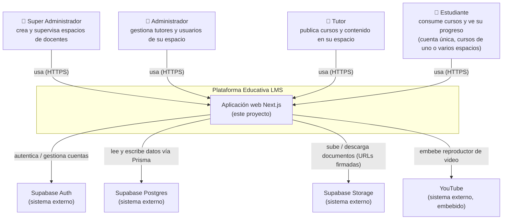
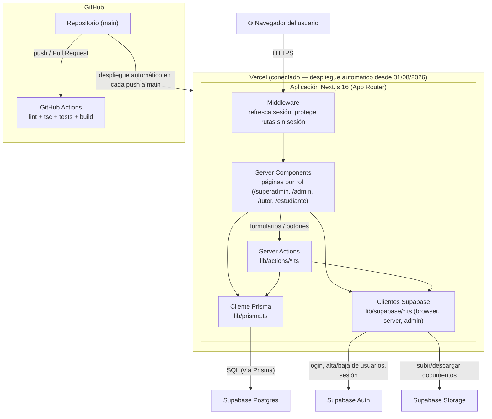
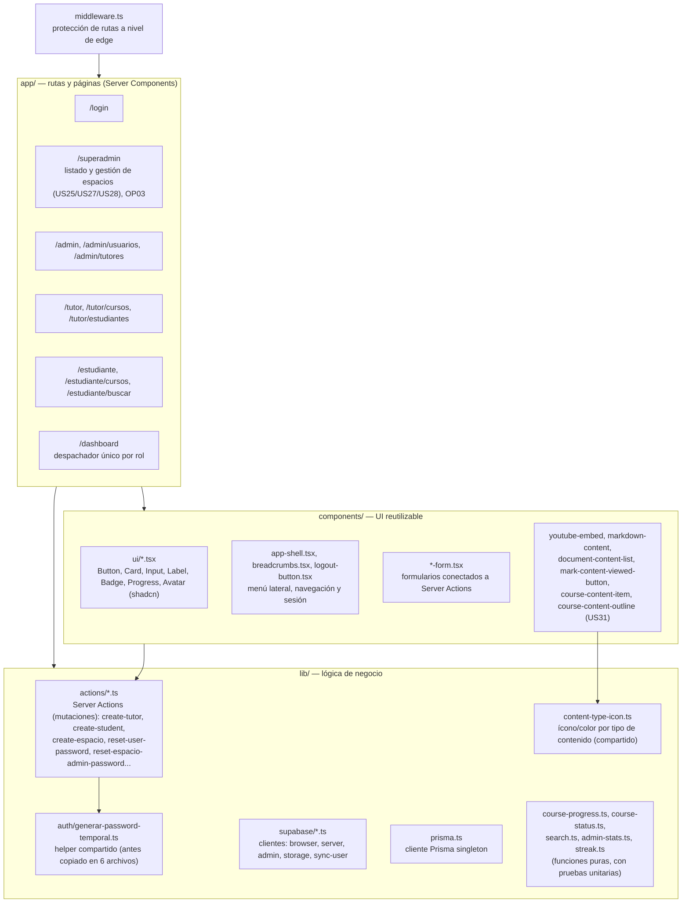
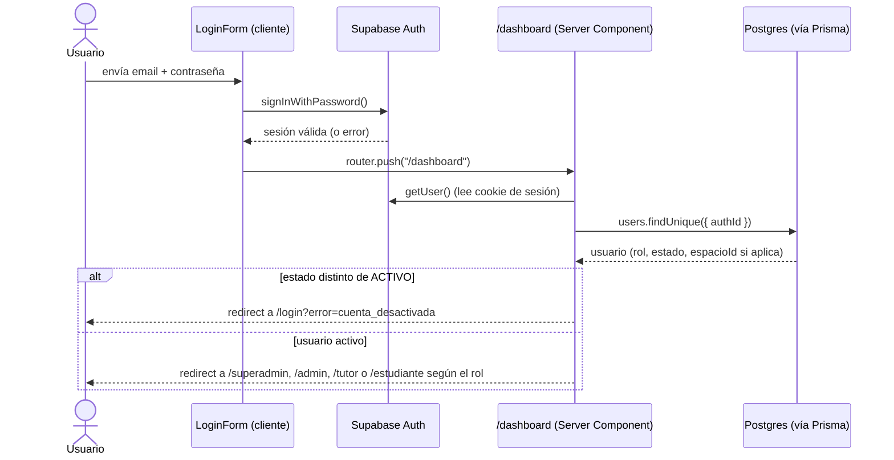
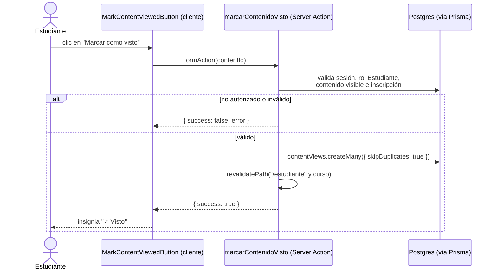
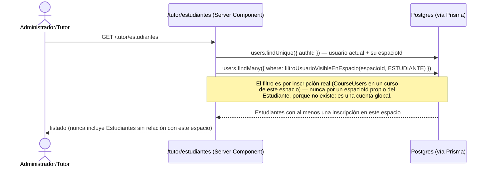
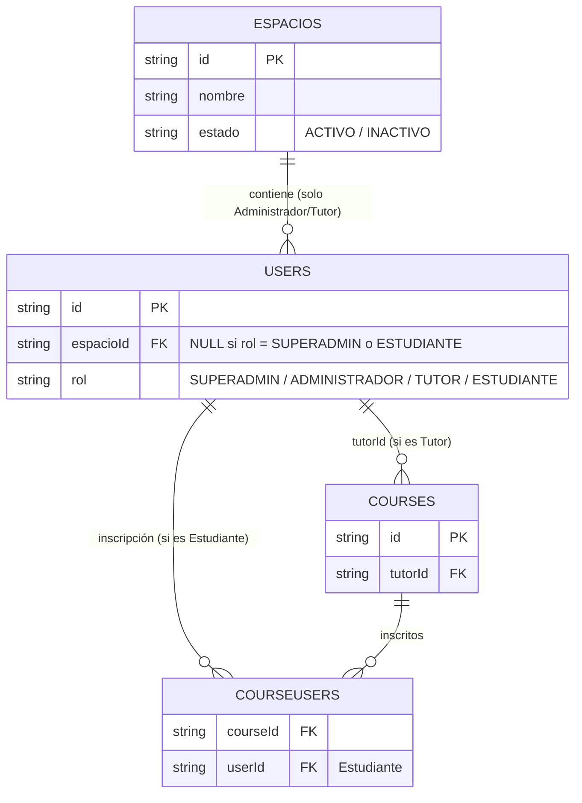

# Diagrama de Arquitectura — Plataforma Educativa LMS

> Modelo C4 (Contexto y Contenedores, con un nivel adicional de Componentes principales), flujo de
> datos de los recorridos más representativos, modelo de datos de aislamiento multi-tenant, y stack
> tecnológico. Los diagramas usan sintaxis de flowchart de Mermaid en vez del tipo
> `C4Context`/`C4Container` nativo de Mermaid porque ese tipo todavía no renderiza de forma confiable
> en la vista de GitHub — esta versión sí se ve correctamente ahí y en cualquier visor de Markdown
> compatible con Mermaid. **Actualizado el 05/09/2026** para reflejar la épica Multi-docente (cerrada
> el 03/09/2026): antes se documentaba como "cambio previsto, aún no implementado" — ya está en
> producción.

## Nivel 1 — Diagrama de Contexto

Quién usa la plataforma y con qué sistemas externos habla.

## Nivel 2 — Diagrama de Contenedores

Qué piezas desplegables componen la plataforma y cómo se relacionan.

## Nivel 3 — Componentes principales (dentro de la aplicación Next.js)

Cómo se organiza el código fuente por responsabilidad.

## Flujo de datos

### Inicio de sesión y despacho por rol

### Un Estudiante marca un contenido como visto (US19)

### Un Administrador/Tutor consulta sus Estudiantes disponibles (aislamiento por espacio, US24)

## Modelo de datos de aislamiento multi-tenant (épica Multi-docente, en producción desde el 03/09/2026)

**Cambio central:** se agregó la entidad `Espacios` (un espacio = un docente/institución) como raíz de
aislamiento — pero **solo para los roles Administrador y Tutor**, no para Estudiante. Un Estudiante
sigue siendo una única cuenta global (igual que en el MVP), y su relación con uno o varios espacios
queda dada por sus inscripciones (`CourseUsers`) a cursos de Tutores de esos espacios, no por un
`espacioId` propio.

**Puntos clave de la migración (US24, `Backlog.md`):**

- `espacioId` en `Users` es **obligatorio solo para `ADMINISTRADOR` y `TUTOR`**; `SUPERADMIN` y
  `ESTUDIANTE` no lo tienen. `SUPERADMIN` opera sobre todos los espacios, pero solo para
  crearlos/listarlos/desactivarlos (US25, US27, US28) y para restablecer la contraseña de su
  Administrador principal (OP03) — nunca para leer datos internos de un espacio ajeno (cursos,
  contenido, progreso de estudiantes).
- El espacio de Fabio Aguirre se creó como registro por defecto en la misma migración que agregó la
  columna `espacioId`, y todos sus `Users` con rol `ADMINISTRADOR`/`TUTOR` (más sus `Courses`) se
  asociaron a él automáticamente, sin ninguna acción manual de su parte ni pérdida de datos. Los
  `Users` con rol `ESTUDIANTE` no necesitaron ningún cambio.
- Las consultas de Admin/Tutor (listado de tutores, de usuarios administrables, de cursos,
  dashboards) agregan `espacioId` a su `where`. El listado de Estudiantes que ve un Administrador/Tutor
  se filtra distinto: por inscripción real en un curso de ese espacio (`filtroUsuarioVisibleEnEspacio`
  en `lib/actions/`), nunca por un `espacioId` propio del Estudiante, que no existe — esto es
  intencional, no un descuido: confirmado explícitamente durante la revisión de código del 05/09/2026.
- Las páginas de Estudiante (`/estudiante`, `/estudiante/buscar`, dashboard de progreso) **no
  necesitaron ningún cambio**: ya filtraban todo por `inscritos: { some: { userId } }` (ver
  `app/estudiante/buscar/page.tsx`), que sigue siendo correcto sin importar de cuántos espacios
  distintos vengan esos cursos — confirmado en producción con Estudiantes reales inscritos en cursos
  de más de un espacio.
- Validado en navegador real: la sesión de un Administrador del espacio de prueba "Castellano" en
  `/admin/usuarios` el 02/09/2026 confirmó que solo ve su propia cuenta, ningún usuario de otros
  espacios; y pruebas unitarias dedicadas confirman que un Administrador/Tutor no puede leer ni
  escribir datos de otro espacio aunque conozca su ID directamente.

## Stack tecnológico

| Capa | Tecnología | Rol en el proyecto |
|---|---|---|
| Frontend | Next.js 16 (App Router), React 19, TypeScript | Server Components para lectura, Server Actions para escritura — sin API REST/GraphQL separada |
| Estilos / UI | Tailwind CSS v4, shadcn/ui (`base-vega`), lucide-react | Sistema de diseño con tokens de color (`app/globals.css`) y componentes reutilizables (`components/ui/*`); paleta de acentos adicional "estilo Duolingo" (verde/azul/naranja/dorado) usada en el panel del Estudiante desde el rediseño del 04/09/2026 |
| Animación / gamificación | `canvas-confetti` | Confeti al completar un curso por primera vez, en el panel del Estudiante (rediseño del 04/09/2026) |
| Validación | Zod | Valida los datos de entrada de cada Server Action antes de tocar la base de datos |
| Datos | PostgreSQL (Supabase), Prisma ORM | Prisma define el esquema (`prisma/schema.prisma`) y genera el cliente tipado; las migraciones versionan cada cambio de esquema, incluida la de `Espacios`/`SUPERADMIN` de la épica Multi-docente |
| Autenticación | Supabase Auth (`@supabase/ssr`, `@supabase/supabase-js`) | Login, sesión, y alta/baja de usuarios vía Admin API (`service_role`, solo en servidor) |
| Almacenamiento de archivos | Supabase Storage | Bucket privado `documentos`, con URLs de descarga firmadas y de corta duración |
| Pruebas | Vitest | Pruebas unitarias de Server Actions, funciones puras y páginas (mockeando Prisma/Supabase) |
| Calidad de código | ESLint 9, TypeScript (`tsc --noEmit`) | Corridos en cada Pull Request vía CI; desde el 05/09/2026 se suma una revisión periódica de duplicación de código (ver `Herramientas_y_Metodologia.md`) |
| CI/CD | GitHub Actions (`.github/workflows/ci.yml`) | Lint + revisión de tipos + pruebas + build en cada Pull Request y push a `main` |
| Despliegue | Vercel | **Conectado desde el 31/08/2026** — despliegue automático desde `main`, con previews por Pull Request |
| Control de versiones | Git + GitHub | Un commit por historia/cambio, con mensajes descriptivos; ver `Herramientas_y_Metodologia.md` |
