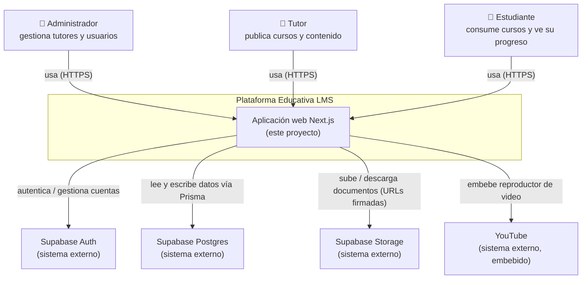
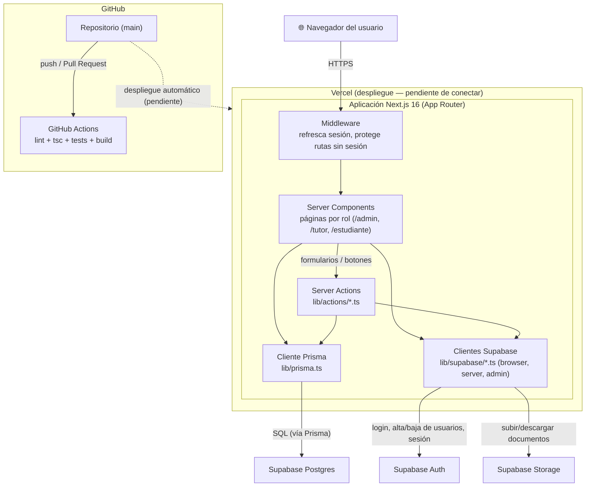
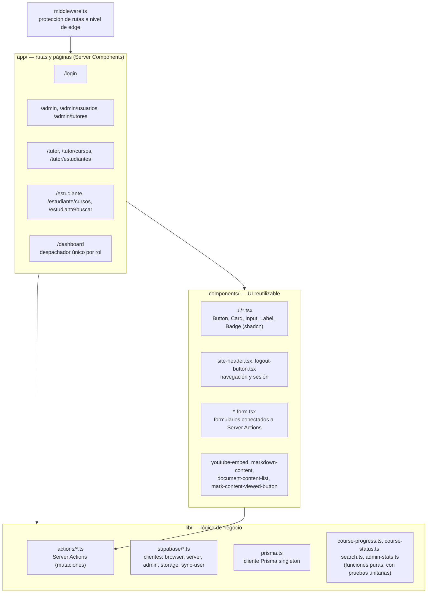
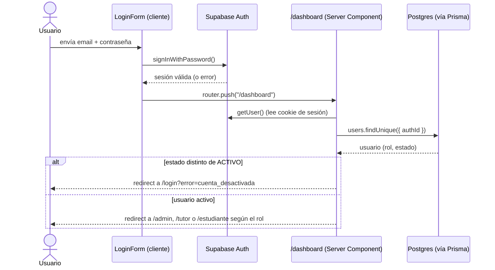
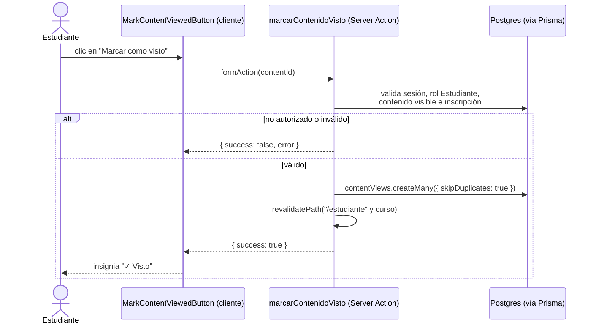

# Diagrama de Arquitectura — Plataforma Educativa LMS

> Modelo C4 (Contexto y Contenedores, con un nivel adicional de Componentes principales), flujo de
> datos de los dos recorridos más representativos, y stack tecnológico. Los diagramas usan sintaxis
> de flowchart de Mermaid en vez del tipo `C4Context`/`C4Container` nativo de Mermaid porque ese tipo
> todavía no renderiza de forma confiable en la vista de GitHub — esta versión sí se ve correctamente
> ahí y en cualquier visor de Markdown compatible con Mermaid.

## Nivel 1 — Diagrama de Contexto

Quién usa la plataforma y con qué sistemas externos habla.

## Nivel 2 — Diagrama de Contenedores

Qué piezas desplegables componen la plataforma y cómo se relacionan.

## Nivel 3 — Componentes principales (dentro de la aplicación Next.js)

Cómo se organiza el código fuente por responsabilidad.

## Flujo de datos

### Inicio de sesión y despacho por rol

### Un Estudiante marca un contenido como visto (US19)

## Stack tecnológico

| Capa | Tecnología | Rol en el proyecto |
|---|---|---|
| Frontend | Next.js 16 (App Router), React 19, TypeScript | Server Components para lectura, Server Actions para escritura — sin API REST/GraphQL separada |
| Estilos / UI | Tailwind CSS v4, shadcn/ui (`base-vega`), lucide-react | Sistema de diseño con tokens de color (`app/globals.css`) y componentes reutilizables (`components/ui/*`) |
| Validación | Zod | Valida los datos de entrada de cada Server Action antes de tocar la base de datos |
| Datos | PostgreSQL (Supabase), Prisma ORM | Prisma define el esquema (`prisma/schema.prisma`) y genera el cliente tipado; las migraciones versionan cada cambio de esquema |
| Autenticación | Supabase Auth (`@supabase/ssr`, `@supabase/supabase-js`) | Login, sesión, y alta/baja de usuarios vía Admin API (`service_role`, solo en servidor) |
| Almacenamiento de archivos | Supabase Storage | Bucket privado `documentos`, con URLs de descarga firmadas y de corta duración |
| Pruebas | Vitest | Pruebas unitarias de Server Actions, funciones puras y páginas (mockeando Prisma/Supabase) |
| Calidad de código | ESLint 9, TypeScript (`tsc --noEmit`) | Corridos en cada Pull Request vía CI |
| CI/CD | GitHub Actions (`.github/workflows/ci.yml`) | Lint + revisión de tipos + pruebas + build en cada Pull Request y push a `main` |
| Despliegue | Vercel (pendiente de conectar) | Despliegue automático desde `main`, con previews por Pull Request |
| Control de versiones | Git + GitHub | Un commit por historia/cambio, con mensajes descriptivos; ver `Herramientas_y_Metodologia.md` |
